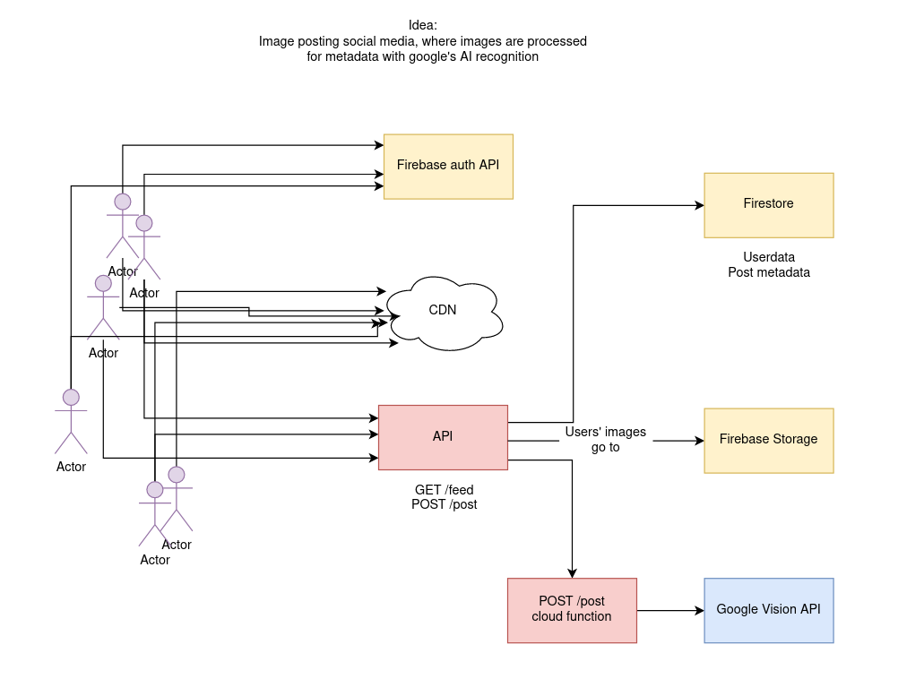

# Yuzo

## Description

The social media for image recognition. This is a project for testing out cool API stuff and cloud services.

## Project status

The project has been suspended since 02/2022. I learned a lot and now it's time to dive into other stuff.

## Preview:

https://yuzo.netlify.app

# Architecture

What's UML anyway?
